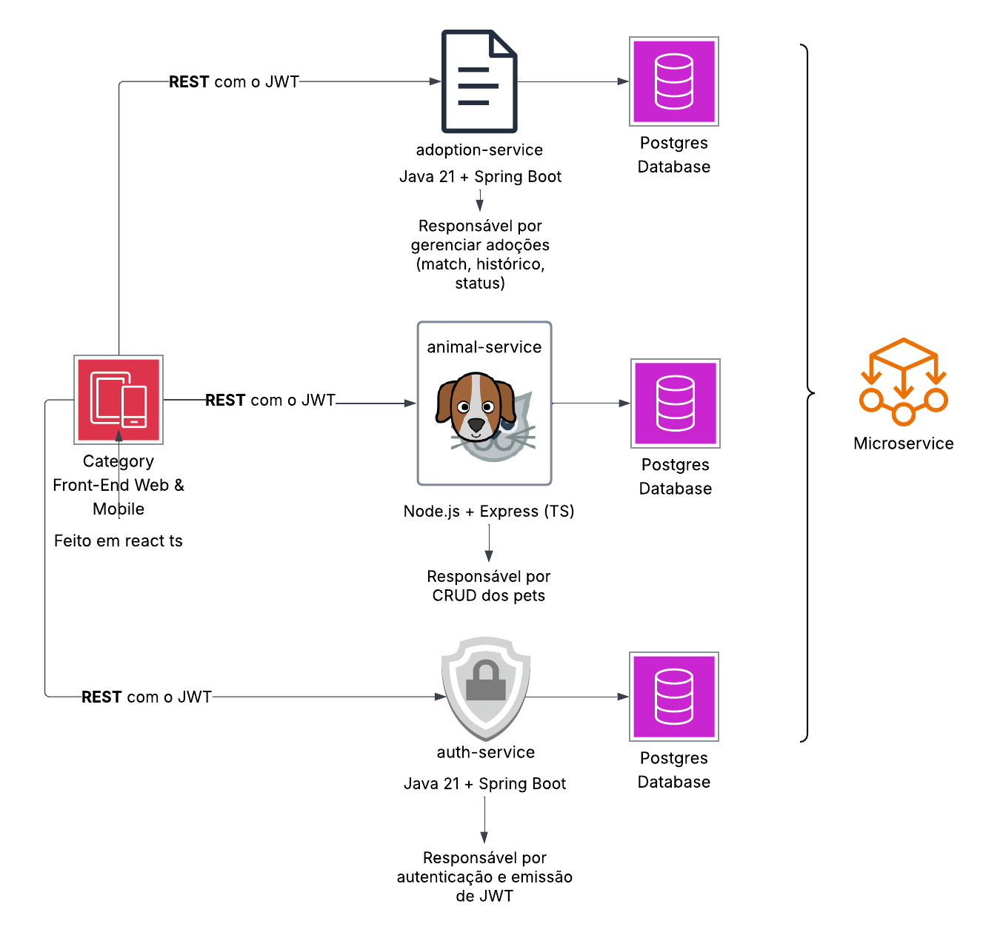
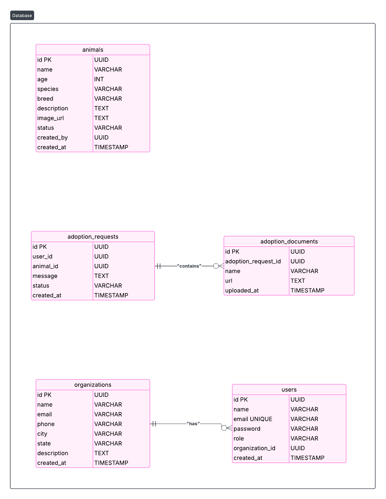

# 🐾 Animal Adoption Platform — Microservices Architecture

Este repositório contém a arquitetura completa do sistema de adoção de animais, baseado em microsserviços, com autenticação JWT, separação de responsabilidades por serviço, e BFF para otimização do consumo no frontend.

---

## 📸 Arquitetura do Sistema

---

## 🧱 Bancos de Dados por Serviço

Cada microsserviço possui seu próprio banco PostgreSQL isolado, seguindo o princípio de banco por serviço.

---

## ⚙️ Microsserviços

### 🔐 Auth Service
- **Stack**: Java 21 + Spring Boot
- **Responsável por**: autenticação, cadastro de usuários, emissão e validação de JWT.
- **Banco**: `auth_db`
  - Tabelas: `users`, `organizations`

### 🐾 Animal Service
- **Stack**: Node.js + Express + TypeScript
- **Responsável por**: CRUD dos animais (pets), upload de imagem (Cloudinary).
- **Banco**: `animal_db`
  - Tabela: `animals`

### 📩 Adoption Service
- **Stack**: Java 21 + Spring Boot
- **Responsável por**: gerenciamento de adoções (match, histórico, status), upload de documentos.
- **Banco**: `adoption_db`
  - Tabelas: `adoption_requests`, `adoption_documents`

---

## 🔐 Autenticação com JWT

- JWT emitido pelo `auth-service`
- Payload inclui `userId`, `role`, e `organizationId` (para ADMINs)

---

## 🧪 Tecnologias utilizadas

- Node.js + Express (Animal Service)
- Java 21 + Spring Boot (Auth Service + Adoption Service)
- PostgreSQL (um por serviço)
- Docker e Docker Compose
- Cloudinary (upload de imagens)